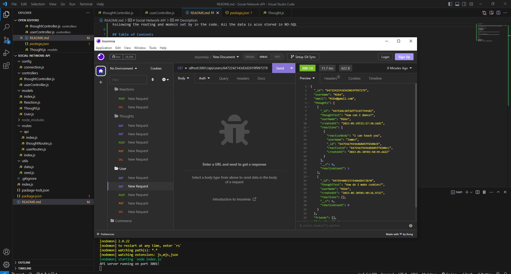

# Social-Network-API

## Description

This is a backend MVC where it mocks a day to day social network you see in everyday on internet. It creates new users, friends, thoughts, and reactions to the thoughts by following the routing and models set by in the code. All the data is also stored in NO-SQL

## Table of Contents

- [Installation](#installation)
- [Usage](#usage)
- [License](#license)
- [Features](#features)

## Installation

Express, Nodemon, and Mongoose were all installed to make this code function well/

## Usage

 
[Click here to see the Tutorial](https://watch.screencastify.com/v/CBX0541FPVA7V6VVcLNN)

## License

N/A

## Features

-GET Users and Thoughts 
-GET One User or Thought 
-POST Users, Friends, Thoughts, and Reactions 
-PUT User or Thought 
-DELETE User, Friends, Thoughts, and Reactions
